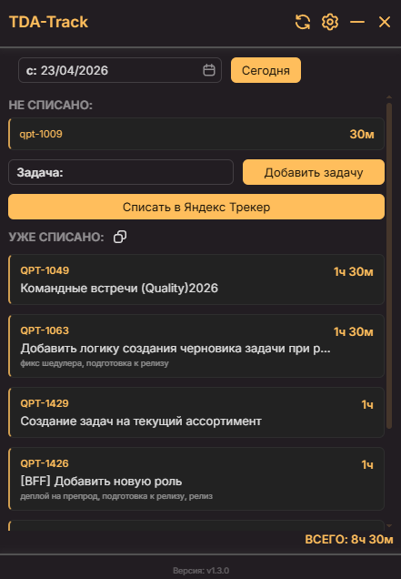
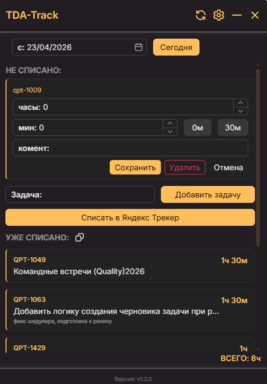
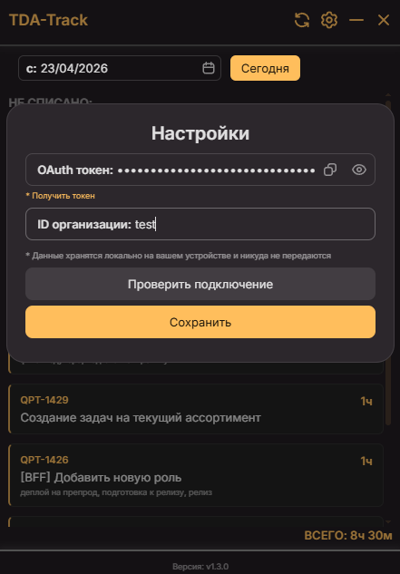
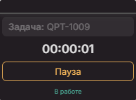

# TDA-Track

> Десктопное приложение для трекинга рабочего времени с интеграцией в **Яндекс Трекер**

## О приложении

**TDA-Track** — клиент для разработчиков, которые ведут задачи в Яндекс Трекере.

Приложение позволяет:

- ⏱ **Трекать время** прямо во floating-окне поверх всех приложений, не переключая контекст
- 📋 **Управлять несписанным временем** по задачам за любой день
- ✅ **Списывать время одним кликом** в Яндекс Трекер через официальный API
- 📊 **Контролировать уже списанное** — видеть историю ворклогов за день
- 🔄 **Автообновляться** — встроенный механизм обновления приложения

> Данные авторизации хранятся **локально** на вашем устройстве и никуда не передаются.

---

## Скриншоты

### Главное меню

---

### Редактирование задачи

Клик по задаче раскрывает inline-редактор: задать часы, минуты и комментарий. Быстрые кнопки `0м` / `30м` ускоряют ввод.

---

### Настройки

Панель настроек появляется поверх основного окна. Вводится OAuth-токен и ID организации.

---

### Дополнительное окно — Float-таймер

Компактное окно-оверлей с таймером. Вводишь номер задачи, нажимаешь «Пуск» — таймер идёт поверх всех окон. Каждую минуту время автоматически сохраняется локально.

---

## Быстрый старт

### Установка

Скачайте установщик для вашей платформы на [странице релизов](https://github.com/Dmitry4705410/tda-track/releases).

### Настройка подключения

1. Откройте приложение → нажмите ⚙️ **Настройки**
2. Перейдите по ссылке **«Получить токен»** — откроется страница авторизации Яндекса
3. Скопируйте полученный OAuth-токен в поле
4. Введите **ID организации** из Яндекс Трекера
5. Нажмите **«Проверить подключение»** — приложение проверит токен
6. Нажмите **«Сохранить»**

---
